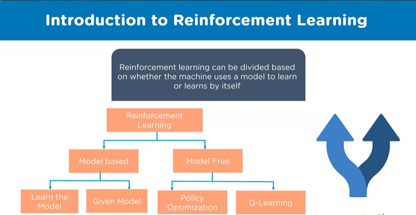
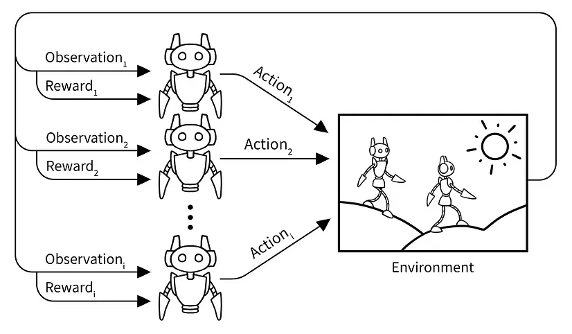

# Reinforcement Learning : Q-learning




## Table of Contents

- [Qlearning Algorithm](#qlearning-algorithm)
  - [Introduction](#introduction)
  - [Environment](#environment)
  - [Arguments](#arguments)
- [Firs Approach : Sequential Q-learning](#firs-approach--sequential-q-learning)
  - [Steps](#steps)
  - [Implementation](#implementation)
  - [Results](#results)
- [Second Approach : Multi-agent Q-learning](#second-approach--multi-agent-q-learning)
  - [Steps](#steps-1)
  - [Implementation](#implementation-1)
  - [Results](#results-1)
- [Conclusion](#conclusion)

## Introduction

Q-learning is a value-based reinforcement learning algorithm. The goal of Q-learning is to learn a policy, which tells an agent what action to take under what circumstances. It does not require a model of the environment and can handle problems with stochastic transitions and rewards, without requiring adaptations.

Q-learning can identify an optimal action-selection policy for any given finite Markov decision process (FMDP). It works by learning an action-value function that ultimately gives the expected utility of taking a given action in a given state and following the optimal policy thereafter.

A Q-learning agent interacts with the environment repeatedly. In each time step, the agent chooses an action, and the environment returns an observation and a reward. The goal is to maximize the total reward.

In this project, we will use Q-learning to solve a grid world problem.

We will use two different approaches to solve this problem. In the first approach, we will use a sequential way to solve the problem. In the second approach, we will use a multi-agent approach to solve the problem.

## Environment

The environment is a 53x3 grid world. There are 4 actions in each state. The agent can move in 4 directions: up, down, left, and right. The agent receives a reward of 0 for each action and an additional reward of +1 for arriving at the destination. The agent receives a penalty of -1 when it arrives at a dangerous location.

## Arguments

```Java
public class QLUtils {
    public static final double ALPHA=0.1;
    public static final double GAMMA=0.9;
    public static final double EPSILON=0.3;
    public static final double MAX_EPOCHS=2000;
    public static final int GRID_SIZE=6;
    public static final int ACTIONS_SIZE=4;

    public static final int[][] ACTIONS={{-1,0},{1,0},{0,-1},{0,1}};
    public static final int[][] GRID={
        //0=nothing , -1= dangerous, 1=goal
        {0, 0, 0,0,0,0},
        {0, 0, 0, 0,-1,0},
        {0, 0, 0,0,0,0},
        {0, 0, -1,-1,0,0},
        {0, 0, 0,0,0,0},
        {0, 0,0,0,0,1}
    };

    public static final int NUMBER_OF_AGENTS=5;


}
```

# Firs Approach : Sequential Q-learning

### Steps

1. Initialize the Q-table to all zeros.
2. Start exploring actions: For each state, select any one among all possible actions for the current state (S).
3. Travel to the next state (S') as a result of that action (a).
4. For all possible actions from the state (S') select the one with the highest Q-value.
5. Update Q-table values using the equation.

$$Q(s_t, a_t) = Q(s_t, a_t) + \alpha * (R_t + \gamma * max(Q(s_{t+1}, a)) - Q(s_t, a_t))$$

6. Set the next state as the current state.
7. If goal state is reached, then end and repeat the process.
8. If it arrives at a dangerous location, then end and repeat the process.

### Implementation

```Java
public class QLearning {

    private int[][] grid;
    private double[][] qTable = new double[GRID_SIZE * GRID_SIZE][ACTIONS_SIZE];
    private int[][] actions;

    // Define the starting point
    private int stateI;
    private int stateJ;

    public QLearning() {
        actions = new int[][] {
                { 0, 1 }, // right
                { 1, 0 }, // down
                { 0, -1 }, // left
                { -1, 0 } // up
        };
        grid = new int[][] {
                // 0 = nothing, -1 = obstacle, 1 = goal
                { 0, 0, 0, 0, 0, 0 },
                { 0, 0, 0, 0, -1, 0 },
                { 0, 0, 0, 0, 0, 0 },
                { -1, -1, -1, -1, -1, 0 },
                { 0, 0, 0, 0, 0, 0 },
                { 0, 0, 0, 0, 0, 1 }
        };
    }

    private void resetState() {
        stateI = 0;
        stateJ = 0;
    }

    private int chooseAction(double epsilon) {
        Random random = new Random();
        int bestAction = 0;
        double bestQValue = Double.MIN_VALUE;
        if (random.nextDouble() < epsilon) {
            // Exploration: Choose a random action
            bestAction = random.nextInt(ACTIONS_SIZE);
            int[] chosenAction = actions[bestAction];
        } else {
            // Exploitation: Choose the action with the highest reward
            int state = stateI * GRID_SIZE + stateJ; // Convert the position to a unique number
            for (int i = 0; i < ACTIONS_SIZE; i++) {
                if (qTable[state][i] > bestQValue) {
                    bestQValue = qTable[state][i];
                    bestAction = i;
                }
            }

        }
        return bestAction;
    }

    private boolean finished() {
        return grid[stateI][stateJ] == 1;
    }

    private int executeAction(int action) {
        // Bounce back if action is not valid
        stateI = Math.max(0, Math.min(stateI + actions[action][0], GRID_SIZE - 1));
        stateJ = Math.max(0, Math.min(stateJ + actions[action][1], GRID_SIZE - 1));
        return stateI * GRID_SIZE + stateJ;
    }

    private void printQTable() {
        System.out.println("***********qTable***********");
        for (double[] row : qTable) {
            System.out.print("|");
            for (double value : row) {
                System.out.print(value + "|\t");
            }
            System.out.println("|");
        }
        // System.out.println(Arrays.deepToString(qTable));
        resetState();
        while (!finished()) {
            int currentState = stateI * GRID_SIZE + stateJ;
            int action = chooseAction(0); // No exploration
            System.out.println("State: (" + currentState + ") | Best action: " + action);

            int newState = executeAction(action);
            System.out.println("New state: (" + newState + ")");

        }
        // System.out.println("Final State: ("+stateI+" "+stateJ+")");
    }

    public void runQLearning() {
        // IN MAS: This is a One Shot Behavior
        int iteration = 0;
        int currentState;
        int newState;
        resetState();
        // This is a Cycling Behavior
        while (iteration < MAX_EPOCHS) {
            resetState();
            while (!finished()) {
                // Current state and best action
                currentState = stateI * GRID_SIZE + stateJ;
                int action = chooseAction(0.3);

                // Next state and its best action
                newState = executeAction(action);
                int action2 = chooseAction(0);

                // Update Q-Table
                qTable[currentState][action] = qTable[currentState][action]
                        + ALPHA * (grid[stateI][stateJ]
                                + GAMMA * qTable[newState][action2]
                                - qTable[currentState][action]);
            }
            iteration++;
        }
        printQTable();
    }
}
```

### Results

```bash
***********qTable***********
|0.3874204889999975|	0.3138105115754162|	0.3486784399576183|	0.34867844003996645|	|
|0.43046720999999744|	0.34867843087323913|	0.3486784381274481|	0.3874204889117825|	|
|0.47829689999999736|	0.3874204875944293|	0.38742048792582745|	0.4304672099819629|	|
|0.5314409999999974|	0.5115976102318408|	0.4304672098389642|	0.4782968999063541|	|
|0.5904899999999977|	-0.40951000603574417|	0.4782968998154497|	0.531440999466755|	|
|0.5904899947631348|	0.6560999999999979|	0.5314409992693973|	0.5904899986682535|	|
|0.2808133918291538|	0.14990706917472965|	0.2810990464264521|	0.3486784333374303|	|
|0.30642021052007684|	0.35607706169159936|	0.26555605025845386|	0.38742048653299993|	|
|0.2823053337721353|	0.3739082457489844|	0.24934448193184056|	0.43046720994927723|	|
|-0.4350109901165987|	0.583695230674976|	0.31972301742170983|	0.4782968789420375|	|
|0.6560999999999971|	0.6198329633037004|	0.4422097559016798|	0.5091917910807698|	|
|0.6560999995687546|	0.7289999999999983|	-0.40951000907275714|	0.5904899992500762|	|
|0.31822883220854126|	-0.3487563453204602|	0.02728951729648066|	0.05961158539211689|	|
|0.5147473309434254|	-0.5179787258523889|	0.04842923617303001|	0.06607126307006347|	|
|0.5898048875759778|	-0.5340173424462108|	0.22815855782692956|	0.17825948016815427|	|
|0.6560994751663093|	-0.47308017290578247|	0.423281370751235|	0.2913492365150411|	|
|0.728999999999984|	-0.2699808619361709|	0.5618306040392167|	-0.40186086421301787|	|
|0.7289999998877487|	0.8099999999999987|	0.6560999997247641|	0.6560999999017046|	|
|-0.10830171244237607|	0.0|	0.0|	0.054113178426053815|	|
|-0.4531856074131294|	0.0|	0.0|	0.0|	|
|-0.09912446467530495|	7.121476807117887E-4|	-0.2355974494142353|	0.3746762511194779|	|
|-0.08611533853743761|	0.013320896508383504|	-0.23218742935704575|	0.5392485705489392|	|
|0.8099999997150678|	0.6509072119784871|	-0.5387999449837512|	0.5670789949891158|	|
|0.8099999996354552|	0.899999999999999|	-0.2710000083161886|	0.7289999998928508|	|
|0.0|	0.0|	0.0|	0.0|	|
|0.0|	0.0|	0.0|	0.0|	|
|0.007912752007908763|	0.0|	0.0|	-0.08722601215564166|	|
|0.08088357964598904|	0.15638392205955348|	0.0|	-0.1665544334633728|	|
|0.89999994763184|	0.5913591151277563|	0.024569292696690538|	-0.24963530746694848|	|
|0.899999998956678|	0.9999999999999996|	0.8099995106352835|	0.8099999994326685|	|
|0.0|	0.0|	0.0|	0.0|	|
|0.0|	0.0|	0.0|	0.0|	|
|0.002785590000000001|	0.0|	0.0|	0.0|	|
|0.45451943310534826|	0.008080389900000002|	0.0|	0.007912752007908763|	|
|0.9282102012308148|	0.12524641509007803|	0.05035674756903301|	0.19759864395535265|	|
|0.0|	0.0|	0.0|	0.0|	|
State: (0) | Best action: 0
New state: (1)
State: (1) | Best action: 0
New state: (2)
State: (2) | Best action: 0
New state: (3)
State: (3) | Best action: 0
New state: (4)
State: (4) | Best action: 0
New state: (5)
State: (5) | Best action: 1
New state: (11)
State: (11) | Best action: 1
New state: (17)
State: (17) | Best action: 1
New state: (23)
State: (23) | Best action: 1
New state: (29)
State: (29) | Best action: 1
New state: (35)

Process finished with exit code 0
```

# Second Approach : Multi-Agent Q-learning

An implementation of the multi-agent Q-learning approach for solving the grid world problem. The approach involves a master agent and several Q-agents, each running in its own container.

### Steps

- step 1 : Initialize the Q-values for each state-action pair for each agent to arbitrary values.
- step 2 : For each agent, select an action using the epsilon-greedy policy.
- step 3 : Execute the action and observe the reward and the next state.
- step 4 : Update the Q-value for the state-action pair using the Bellman equation.
- step 5 : Repeat steps 2-4 until the goal state is reached.

### Implementation

```Java
public class MainContainer {
    public static void main(String[] args) throws ControllerException {
        Runtime runtime=Runtime.instance();
        ProfileImpl profile=new ProfileImpl();
        profile.setParameter(Profile.GUI,"true");
        AgentContainer mainContainer=runtime.createMainContainer(profile);
        mainContainer.start();
    }
}
```

```Java
public class MasterAgent extends Agent {
    protected void setup() {
        DFAgentDescription dfd = new DFAgentDescription();
        dfd.setName(getAID());
        ServiceDescription sd = new ServiceDescription();
        sd.setType("QLearning");
        sd.setName("masterAgent");
        dfd.addServices(sd);
        try {
            DFService.register(this, dfd);
        }catch (FIPAException e){
            throw new RuntimeException(e);
        }
        addBehaviour(new CyclicBehaviour() {
            @Override
            public void action() {
                ACLMessage receivedMessage = receive();
                double[][] qTable = new double[GRID_SIZE*GRID_SIZE][ACTIONS_SIZE];
                if (receivedMessage != null) {
                    //Receive the Q-TABLE from the agent
                    System.out.println(receivedMessage.getSender().getName());
                    String qTabletring=receivedMessage.getContent();
                    String[] rows=qTabletring.split("\n");
                    //Remove null in the first row
                    rows[0]=rows[0].substring(4);
                    for (int i=0;i<rows.length;i++){
                        String[] columns=rows[i].split(",");
                        for (int j=0;j<columns.length;j++){
                            qTable[i][j]=Double.parseDouble(columns[j]);
                        }
                    }
                    //Print the Q-TABLE
                    for (int i=0;i<GRID_SIZE*GRID_SIZE;i++) {
                        for (int j = 0; j < ACTIONS_SIZE; j++) {
                            System.out.print(qTable[i][j] + " ");
                        }
                        System.out.println();
                    }

                } else {
                    block();
                }
            }
        });


    }

}
```

```Java
public class QAgent extends Agent {
    double[][] qTable = new double[GRID_SIZE*GRID_SIZE][ACTIONS_SIZE];
    int stateI=0;
    int stateJ=0;

    @Override
    public void setup(){
        System.out.println("Hello! Agent  "+getAID().getName()+" is ready.");
        SequentialBehaviour sb = new SequentialBehaviour();
        sb.addSubBehaviour(new OneShotBehaviour() {
            @Override
            public void action() {
                resetState();
            }
        });
        sb.addSubBehaviour(new Behaviour() {
            int currentState;
            int newState;
            int iteration;
            @Override
            public void action() {
                    runQLearning();
            }
            @Override
            public boolean done() {
                return iteration>=MAX_EPOCHS || finished();
            }
        });

        sb.addSubBehaviour(new OneShotBehaviour() {
            @Override
            public void action() {
                //printQTable();
                sendQTable();
            }
        });
        addBehaviour(sb);

    }
    private void resetState(){
        stateI=0;
        stateJ=0;
    }
    private int chooseAction(double epsilon){
        Random random=new Random();
        int bestAction=0;
        double bestQValue = Double.MIN_VALUE;
        if(random.nextDouble()<epsilon){
            //Exploration : Choisir une action aléatoire
            bestAction=random.nextInt(ACTIONS_SIZE);
        }else{
            //Exploitation : Choisir l'action avec la plus grande récompense
            int state = stateI*GRID_SIZE+stateJ; //Convertir la position en un nombre unique
            for (int i=0;i<ACTIONS_SIZE;i++){
                if(qTable[state][i]>bestQValue){
                    bestQValue=qTable[state][i];
                    bestAction=i;
                }
            }

        }
        return bestAction;
    }

    private boolean finished(){
        return GRID[stateI][stateJ]==1;
    }
    private int executeAction(int action){
        //Bounce back if action is not valid
        stateI=Math.max(0,Math.min(stateI+ACTIONS[action][0],GRID_SIZE-1));
        stateJ=Math.max(0 ,Math.min(stateJ+ACTIONS[action][1],GRID_SIZE-1));
        return stateI*GRID_SIZE+stateJ;
    }
    private void printBestPath(){
        resetState();
        System.out.println("Agent "+getAID().getName()+" is starting from ("+stateI+","+stateJ+")");

        while (!finished()){
            int currentState=stateI*GRID_SIZE+stateJ;
            int action=chooseAction(0); //Pas d'exploration
            System.out.println("("+stateI+","+stateJ+") -> "+action);

            int newState=executeAction(action);

        }
        System.out.println("Goal reached : ("+stateI+" "+stateJ+")");
    }

    public void sendQTable(){
        DFAgentDescription dfd=new DFAgentDescription();
        ServiceDescription sd=new ServiceDescription();
        sd.setType("QLearning");
        dfd.addServices(sd);
        DFAgentDescription[] result=null;
        try {
            result=DFService.search(this,dfd);
        } catch (FIPAException e) {
            throw new RuntimeException(e);
        }
        ACLMessage msg = new ACLMessage(ACLMessage.INFORM);
        msg.addReceiver(result[0].getName());
        for (double[] doubles : qTable) {
            for (double aDouble : doubles) {
                msg.setContent(msg.getContent() + aDouble + ",");
            }
            msg.setContent(msg.getContent() + "\n");
        }
        //System.out.println("Message sent: "+msg.getContent());
        send(msg);
    }

    @Override
    public void takeDown(){
        try {
            DFService.deregister(this);
        } catch (FIPAException e) {
            throw new RuntimeException(e);
        }
    }
    public void runQLearning(){
        //IN MAS : This is a One Shot BEhavior
        int iteration=0;
        int currentState;
        int newState;
        resetState();
        //This is a Cycling Behavior
        while (iteration<MAX_EPOCHS){
            resetState();
            while (!finished()){
                //Curent state and best action
                currentState=stateI*GRID_SIZE+stateJ;
                int action=chooseAction(0.3);

                //Next state and its best action
                newState=executeAction(action);
                int action2=chooseAction(0);

                //Update Q-Table
                qTable[currentState][action]=qTable[currentState][action]
                        +ALPHA*(GRID[stateI][stateJ]
                        +GAMMA*qTable[newState][action2]
                        -qTable[currentState][action]
                );
            }
            iteration++;
        }
        printBestPath();
    }

}

```

```Java
public class SimpleContainer {
    public static void main(String[] args) throws StaleProxyException {
        Runtime runtime = Runtime.instance();
        ProfileImpl profile = new ProfileImpl();
        profile.setParameter(ProfileImpl.MAIN_HOST, "localhost");
        AgentContainer agentContainer = runtime.createAgentContainer(profile);
        agentContainer.createNewAgent("masterAgent", MasterAgent.class.getName(), new Object[]{}).start();
        for (int i = 0; i < NUMBER_OF_AGENTS; i++) {
            try {
                //Create a new agent with the name "agent" + i and pass on the stateI and stateJ arguments
                agentContainer.createNewAgent("agent" + i, QAgent.class.getName(), new Object[]{}).start();
            } catch (Exception e) {
                e.printStackTrace();
            }
        }

    }
}

```

## results

### Best Paths

```bash
Hello! Agent  agent0@192.168.1.106:1099/JADE is ready.
Hello! Agent  agent1@192.168.1.106:1099/JADE is ready.
Hello! Agent  agent2@192.168.1.106:1099/JADE is ready.
Hello! Agent  agent3@192.168.1.106:1099/JADE is ready.
Hello! Agent  agent4@192.168.1.106:1099/JADE is ready.
Agent agent0@192.168.1.106:1099/JADE is starting from (0,0)
(0,0) -> 3
(0,1) -> 3
(0,2) -> 3
(0,3) -> 3
(0,4) -> 3
(0,5) -> 1
(1,5) -> 1
(2,5) -> 1
(3,5) -> 1
(4,5) -> 1
Goal reached : (5 5)
Agent agent2@192.168.1.106:1099/JADE is starting from (0,0)
(0,0) -> 3
(0,1) -> 3
(0,2) -> 3
(0,3) -> 3
(0,4) -> 3
(0,5) -> 1
(1,5) -> 1
(2,5) -> 1
(3,5) -> 1
(4,5) -> 1
Goal reached : (5 5)
Agent agent4@192.168.1.106:1099/JADE is starting from (0,0)
(0,0) -> 3
(0,1) -> 3
(0,2) -> 3
(0,3) -> 3
(0,4) -> 3
(0,5) -> 1
(1,5) -> 1
(2,5) -> 1
(3,5) -> 1
(4,5) -> 1
Goal reached : (5 5)
Agent agent1@192.168.1.106:1099/JADE is starting from (0,0)
(0,0) -> 3
(0,1) -> 3
(0,2) -> 3
(0,3) -> 3
(0,4) -> 3
(0,5) -> 1
(1,5) -> 1
(2,5) -> 1
(3,5) -> 1
(4,5) -> 1
Goal reached : (5 5)
Agent agent3@192.168.1.106:1099/JADE is starting from (0,0)
(0,0) -> 3
(0,1) -> 3
(0,2) -> 3
(0,3) -> 3
(0,4) -> 3
(0,5) -> 1
(1,5) -> 1
(2,5) -> 1
(3,5) -> 1
(4,5) -> 1
Goal reached : (5 5)
```

### Q-Tables

```bash
agent0@192.168.1.106:1099/JADE
0.34867843889971595 0.31381054966767624 0.3486784396046058 0.3874204889999975
0.38742048721412586 0.3486784386231792 0.34867843947839783 0.43046720999999744
0.430467209996667 0.3874204888288516 0.38742048899148046 0.47829689999999736
0.4782968995056102 0.43046720891817997 0.43046720934463373 0.5314409999999974
0.5314409987022358 -0.4095100002700213 0.47829689701078015 0.5904899999999977
0.5904899998883641 0.6560999999999979 0.5314409997044255 0.5904899999292189
0.3486784351883672 0.06083691964856201 0.2605815136541366 0.3066876611162774
0.33508563437305194 0.27147685334461386 0.25680099086128444 0.3874204889920947
0.43046720999999744 0.29252041658598155 0.3372469116259736 0.41588299154744657
0.4782968999993957 0.30678093305252835 0.3010393687833931 -0.4319300914915779
0.5233208064330241 0.5968416058565136 0.40827931754979796 0.6560999999999979
0.5904899999910276 0.7289999999999983 -0.409510001031372 0.6560999987132051
0.08558317908955124 0.0 0.005177063476485465 0.1765797982502184
0.3439019576615444 0.01575675197273164 0.0185742995394071 0.13841542687907485
0.378475374865711 -0.6123284843769604 0.17951382321610887 0.11020004608068153
0.4294618845865539 -0.65645650725531 0.14166332886142005 -0.05501847257428161
-0.4743343458269878 0.5230591321924289 0.3249327803220652 0.7289999996961523
0.6560999972889424 0.8099999999999987 0.656099995989458 0.7289999996989549
0.006744899215688673 0.0 0.0 0.0
0.12311257434572027 0.0 0.0 0.0
0.18835672866224193 -0.08658684398576233 0.007186054618730992 -0.1
0.358962014370852 -0.0864758135970244 -0.2442155924551125 0.2506317533954262
0.4912579997523056 0.6697586928129108 -0.6875404600952434 0.8099999996612931
0.7289999998821717 0.899999999999999 0.7289999972354505 0.8099999999570295
0.0 0.0 0.0 0.0
0.0 0.0 0.0 0.0
-0.4253282697693178 0.0 0.0 -0.030295408174815186
-0.5884825220121364 -0.03781823817375533 0.0 0.27855614205382584
0.5715176106650337 0.4127471975017857 -0.18266132713234645 0.8999998980138889
0.8099999924208249 0.9999999999999996 0.8099990446476806 0.8999999971326178
0.0 0.0 0.0 0.0
0.0 0.0 0.0 0.0
-0.0323974794257201 0.0 0.0 0.0
-0.11436621197470764 0.0 -0.002268000000000001 0.0
0.12503326882122698 0.0 -0.00563646363854688 0.7712320754503901
0.0 0.0 0.0 0.0
agent2@192.168.1.106:1099/JADE
0.3486784399275654 0.31381058989300314 0.3486784397029839 0.3874204889999975
0.38742048839289217 0.34867842151227035 0.348678439939877 0.43046720999999744
0.43046720998613
```

# Conclusion

In this project, we explored two different approaches to solving the taxi problem using Q-learning. The sequential Q-learning approach trains a single agent to navigate the grid world, while the multi-agent Q-learning approach involves multiple agents learning and updating their Q-tables.

Both approaches have their advantages and limitations, and the choice of approach depends on the specific problem and requirements. Q-learning is a powerful technique in reinforcement learning and can be applied to various scenarios.

By experimenting with different parameters, environments, and approaches, we can further optimize and improve the performance of Q-learning algorithms.

# Author

Abderrahmane ET-TOUNANI - [Github](https://github.com/ET-TOUNANI)
All rights reserved :D
